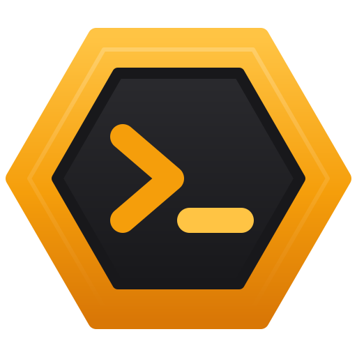

<p align="center"></p>

<h1 align="center">Hive</h1>

<p align="center">An agent-first desktop workspace for AI-assisted coding.<br>Run Claude Code across your projects, side by side.</p>

---

Hive looks and feels like a streamlined VS Code, but it is built around **agent sessions** rather than a text editor. Open a workspace, mark the projects you're working on, and each one gets its own Claude Code session running in parallel. Hive tracks what every agent is doing, how many tokens it uses, and which skills and MCP servers it has, and it tells you when an agent finishes or needs you.

## Features

- **Parallel sessions** — Claude Code sessions across your projects, as many as your machine can run, with live status (ready / working / needs input / finished), Compact, and screenshots pasted straight into the session.
- **Several agents per project** — up to four, side by side in columns or a grid, each in the project folder (with file locks so they don't edit the same file) or in its own git worktree, then review and merge their work. Each agent shows which conversation it's on; Resume picks from recent sessions, and a conversation is only ever open in one agent.
- **Transcript viewer** — read every session in full, including what came before each compaction, search across sessions, export as Markdown and resume.
- **Files** — a file browser with an editor and previews for Markdown, CSV, HTML, SVG, images and PDFs; an Images tab for everything sent to the agents.
- **Review** — git changes with side-by-side diffs; edit `CLAUDE.md` and Claude Code's auto memory.
- **Token and plan insight** — context size, cache state, re-cache estimate, compaction history, API-equivalent cost, and your plan's 5-hour and weekly usage with warnings.
- **Workspace and project metadata** — a committed `Workspace/.hive` for shared notes, skills and MCP servers; a git-excluded `Project/.hive` for settings, session history, images and transcript backups.
- **Skills and MCP management** — enable skills and MCP servers for the whole workspace, turn them off per project. Changes apply to new sessions.
- **Session lifecycle** — new, resume (the agent's last session, or pick one), stop, archive (never deleted), adopt sessions started elsewhere.
- **Per-project settings** — model (including pinned versions and 1M context), effort, permission mode, chime and extra CLI arguments.
- **Agent API** — a local REST API and a built-in `hive` MCP server so agents can read shared notes, write handovers, check other projects and notify you.
- **Keeps itself up to date** — updates download in the background and install when you quit or restart, never mid-session; or check, download and install manually.
- **Stays out of the way** — system tray, completion chime, Windows notifications, a project list that collapses to status dots, resizable panes, command palette and keyboard shortcuts.

## Requirements

- Windows 10 or 11 (x64)
- The [Claude Code CLI](https://code.claude.com/docs/en/setup) (required) — Hive offers to install it on first launch. The VS Code extension's built-in copy is not used.
- Git (optional, for the Changes tab)

## Install

Download `Hive-Setup-<version>.exe` from the [latest release](https://github.com/Suremise/hive-desktop/releases/latest) and run it. The installer is not code-signed, so Windows SmartScreen may warn you; choose **More info → Run anyway**. After that Hive keeps itself up to date.

To build the installer yourself, run `npm run dist`; it's written to `dist/`.

## Development

```bash
npm install
npm run dev        # run with hot reload
npm run typecheck  # TypeScript checks
npm test           # unit tests
npm run icons      # regenerate icons from build/*.svg
npm run licenses   # regenerate THIRD_PARTY_NOTICES.md (also run by build)
npm run dist       # build the Windows installer into dist/
npm run release    # build and upload a draft GitHub release (see RELEASING.md)
```

| Path | Contents |
|---|---|
| `src/main` | Electron main process: workspaces, sessions (node-pty), hooks, Agent API, tray |
| `src/main/agents` | Agent adapters (Claude Code) and transcript parsing |
| `src/main/mcp/hive-mcp.ts` | The built-in `hive` MCP server |
| `src/preload` | Typed bridge between the UI and the main process |
| `src/renderer` | React UI |
| `src/shared` | Types and defaults shared by both sides |
| `docs/` | Specification, user guide, Agent API reference, architecture |
| `scripts/` | Icon generation, third-party licence notices |

See [docs/ARCHITECTURE.md](docs/ARCHITECTURE.md) for how it fits together and [docs/SPEC.md](docs/SPEC.md) for product decisions.

## Documentation

- [User Guide](docs/USER_GUIDE.md)
- [Agent API](docs/AGENT_API.md)
- [Architecture](docs/ARCHITECTURE.md)
- [Specification](docs/SPEC.md)
- [Release Notes](CHANGELOG.md)
- [Third-Party Notices](THIRD_PARTY_NOTICES.md)
- [Releasing](RELEASING.md)

## License

Hive is released under the [MIT License](LICENSE). It includes open-source libraries under their own licences; see [THIRD_PARTY_NOTICES.md](THIRD_PARTY_NOTICES.md). Electron's and Chromium's licences are installed alongside the app.

Hive is an independent project and is not affiliated with Anthropic. Claude and Claude Code are products of Anthropic; Claude Code is installed separately under Anthropic's terms.
