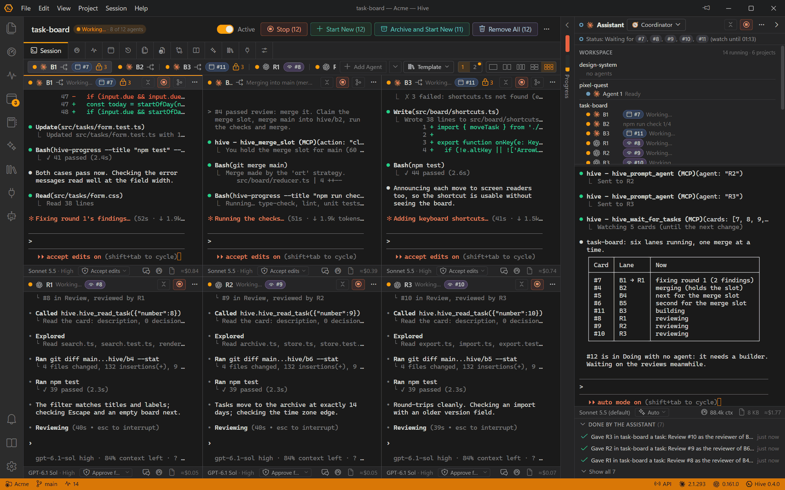
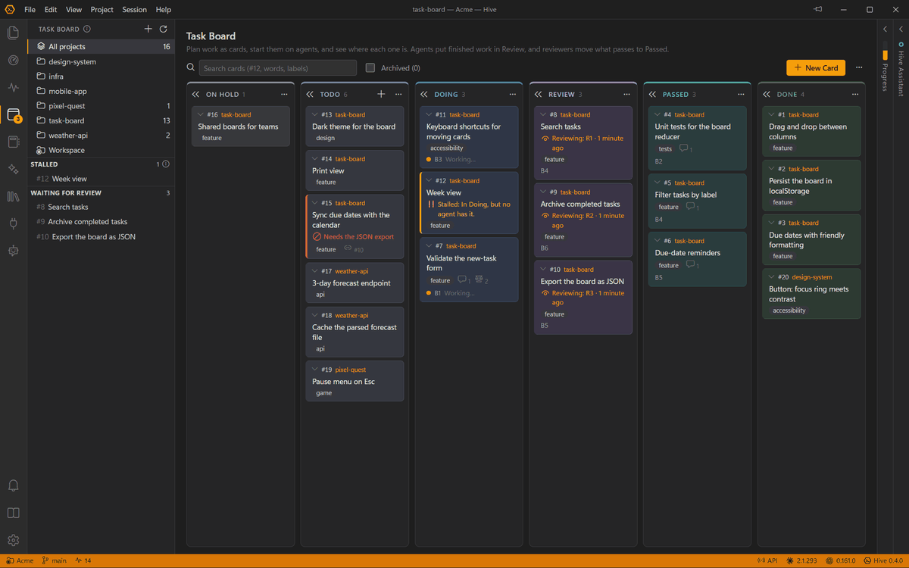
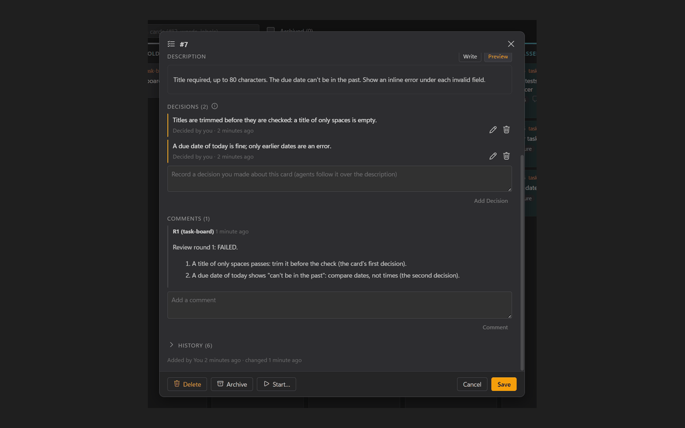
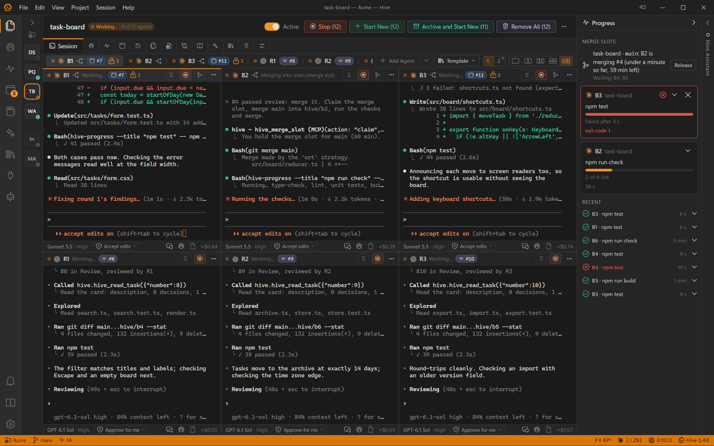
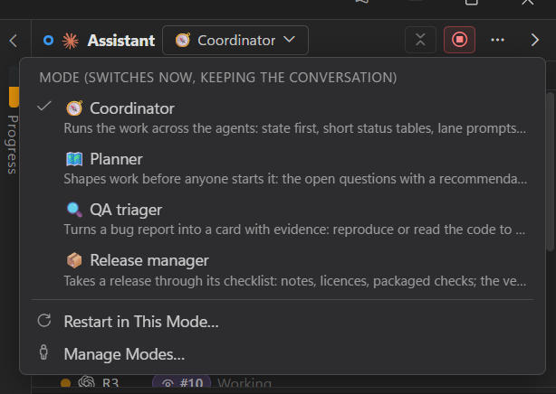

<p align="center"></p>

<h1 align="center">Hive Desktop</h1>

<p align="center">An agent-first desktop workspace for AI-assisted coding.<br>Run Claude Code and Codex across your projects, side by side.</p>

<p align="center"><strong><a href="https://surmise.it">Website</a></strong> · <a href="https://surmise.it/docs/user-guide/">User Guide</a> · <a href="https://github.com/Suremise/hive-desktop/releases/latest">Download</a></p>

---

Hive Desktop (Hive for short) looks and feels like a streamlined VS Code, but it is built around **agent sessions** rather than a text editor. Open a workspace, mark the projects you're working on, and give each one or more coding agents, or a whole team — **Claude Code** and **Codex**, even side by side in one project. Hive tracks what every agent is doing, how many tokens it uses, and which skills and MCP servers it has, and it tells you when an agent finishes or needs you. A **Hive Assistant** in each workspace can run the work for you: it plans cards, starts agents, follows each lane to the end and asks you only for real decisions.

<picture>
  <source media="(prefers-color-scheme: light)" srcset="docs/images/hero-light.png">
  
</picture>

## Features

- **Claude Code and Codex** — each agent chooses its provider, so a project can mix them, with Claude Code builders and Codex reviewers; each CLI's own terminal is shown. Turn providers on in Settings → Providers; Help → Agent Setup installs and signs them in, and says which versions this Hive was tested with. **Hand Over to…** passes work from one agent to another, across providers, through a handover.
- **Parallel sessions** — sessions across your projects, as many as your machine can run, with live status (ready / working / needs input / waiting on background tasks / finished), Compact, and screenshots pasted straight into the session.
- **A team per project** — up to twelve agents, all equal, six to a page, each with its own name, role, provider, model, effort and permission mode. Each agent works in the project folder (with file locks so agents don't edit the same file) or in its own git worktree; roles such as builder and reviewer are optional. Save a team as a **template** and load it into any project, reusing clean worktrees instead of piling up new ones.
- **Hive Assistant** — one per workspace, in a side panel beside your agents: ask it what they are doing, or let it run the work: it plans cards, briefs and starts agents, follows each lane to the end and asks you only for real decisions. Four working modes — Coordinator, Planner, QA triager and Release manager, or write your own; Settings → Assistant sets what it may do.
- **Card loops on the task board** — one board for the workspace, from On Hold and Todo through Doing, Review and Passed to Done. Builders and reviewers take cards in turn: a reviewer passes a card or sends it back with numbered findings, and each waits for the other without running. What you decide about a card is pinned above its comments, and agents follow it over the description.
- **Worktrees and one merge at a time** — give an agent its own worktree and branch, review what it changed, then merge it back, keeping its commits or squashing them. Agents take turns at the merge slot, and the Progress panel shows who is merging, who is waiting and how far each long run has got.
- **Several windows** — open another workspace in its own window, each with its own projects and agents.
- **Transcript viewer** — read every session in full, including what came before each compaction, search across sessions, export as Markdown and resume.
- **Files** — a file browser with an editor and previews for Markdown, CSV, HTML, SVG, images and PDFs; an Images tab for everything sent to the agents.
- **Review** — git changes with side-by-side diffs; edit `CLAUDE.md`, `AGENTS.md` and Claude Code's auto memory, or share one `AGENTS.md` between providers.

<table>
  <tr>
    <td width="50%">
      <picture>
        <source media="(prefers-color-scheme: light)" srcset="docs/images/board-light.png">
        
      </picture>
    </td>
    <td width="50%">
      <picture>
        <source media="(prefers-color-scheme: light)" srcset="docs/images/card-light.png">
        
      </picture>
    </td>
  </tr>
  <tr>
    <td width="50%">
      <picture>
        <source media="(prefers-color-scheme: light)" srcset="docs/images/progress-light.png">
        
      </picture>
    </td>
    <td width="50%">
      <picture>
        <source media="(prefers-color-scheme: light)" srcset="docs/images/modes-light.png">
        
      </picture>
    </td>
  </tr>
</table>

More on the website: [surmise.it](https://surmise.it)

- **Token and plan insight** — a project summary across providers, context size, cache state, re-cache estimate, compaction history, API-equivalent cost (estimated from editable price tables where a provider doesn't report it), and each plan's usage limits with warnings.
- **Workspace and project metadata** — a committed `Workspace/.hive` for shared notes, skills and MCP servers; a git-excluded `Project/.hive` for settings, session history, images and transcript backups.
- **Skills and MCP management** — every Hive skill reaches every agent, the bundled ones for card loops, merging and handovers among them; enable MCP servers for the whole workspace and turn them off per project. Changes apply to new sessions.
- **Session lifecycle** — new, resume (the agent's last session, or pick one), stop, archive, delete (Hive's copies go to the Recycle Bin), adopt sessions started elsewhere.
- **Per-provider and per-project settings** — model, effort, permission mode, extra CLI arguments, globally per provider and overridden per project or agent.
- **Agent API** — a local REST API and a built-in `hive` MCP server so agents can read shared notes, write handovers, check other projects and notify you.
- **Keeps itself up to date** — updates download in the background and install when you quit or restart, never mid-session; or check, download and install manually.
- **Stays out of the way** — system tray, completion chime, Windows notifications, a project list that collapses to status dots, resizable panes, command palette and keyboard shortcuts.

## Requirements

- Windows 10 or 11 (x64)
- At least one coding agent CLI: [Claude Code](https://code.claude.com/docs/en/setup) and/or [Codex](https://developers.openai.com/codex). Hive's Agent Setup offers to install them. Copies built into editor extensions are not used. Hive 0.4.0 was tested with Claude Code 2.1.293 and Codex 0.161.0.
- Git (for the Changes tab, worktrees and merging)

## Install

Download `Hive-Setup-<version>.exe` from the [latest release](https://github.com/Suremise/hive-desktop/releases/latest) and run it. The installer is not code-signed, so Windows SmartScreen may warn you; choose **More info → Run anyway**. After that Hive keeps itself up to date.

To build the installer yourself, run `npm run dist`; it's written to `dist/`.

## Development

```bash
npm install
npm run dev        # run with hot reload
npm run typecheck  # TypeScript checks
npm run lint       # oxlint
npm test           # unit tests (also run by CI on every push)
npm run e2e        # end-to-end suites against a dev build (see tests/e2e/README.md)
npm run icons      # regenerate icons from build/*.svg
npm run licenses   # regenerate THIRD_PARTY_NOTICES.md (also run by build)
npm run dist       # build the Windows installer into dist/
npm run release    # build and upload a draft GitHub release (see RELEASING.md)
```

| Path | Contents |
|---|---|
| `src/main` | Electron main process: workspaces, sessions (node-pty), hooks, Agent API, tray |
| `src/main/providers` | Provider adapters (Claude Code, Codex): launch, hooks, transcripts, usage |
| `src/main/mcp/hive-mcp.ts` | The built-in `hive` MCP server |
| `src/preload` | Typed bridge between the UI and the main process |
| `src/renderer` | React UI |
| `src/shared` | Types, defaults and provider descriptors shared by both sides |
| `tests/` | Unit tests (Vitest) and end-to-end suites (`tests/e2e`, Playwright) |
| `docs/` | Specification, user guide, Agent API reference, architecture |
| `scripts/` | Icon generation, third-party licence notices |

See [docs/ARCHITECTURE.md](docs/ARCHITECTURE.md) for how it fits together and [docs/SPEC.md](docs/SPEC.md) for product decisions.

## Troubleshooting

- **Hive doesn't open, or says "Hive can't start"**: the folder Hive is installed in has a permission entry for a Windows app package but none for ALL APPLICATION PACKAGES, so Hive's sandboxed windows can't read it. Hive adds the entry when it can, and otherwise shows the command to run: see [Troubleshooting](docs/USER_GUIDE.md#troubleshooting) in the user guide.
- Anything else: [Troubleshooting](docs/USER_GUIDE.md#troubleshooting) in the user guide.

## Documentation

- [User Guide](docs/USER_GUIDE.md)
- [Agent API](docs/AGENT_API.md)
- [Architecture](docs/ARCHITECTURE.md)
- [Specification](docs/SPEC.md)
- [Release Notes](CHANGELOG.md)
- [Third-Party Notices](THIRD_PARTY_NOTICES.md)
- [Releasing](RELEASING.md)

## License

Hive is released under the [MIT License](LICENSE). It includes open-source libraries under their own licences; see [THIRD_PARTY_NOTICES.md](THIRD_PARTY_NOTICES.md). Electron's and Chromium's licences are installed alongside the app.

Hive Desktop is independently developed and isn't affiliated with, endorsed or sponsored by Anthropic, OpenAI or GitHub. Claude and Claude Code are products of Anthropic; Codex and ChatGPT of OpenAI; GitHub Copilot and the Copilot CLI of GitHub. Each CLI is installed separately under its maker's terms.
