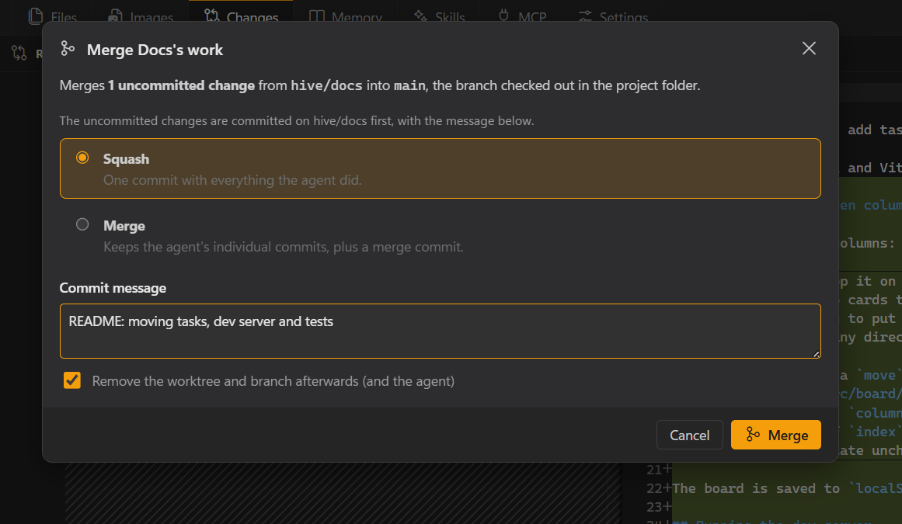
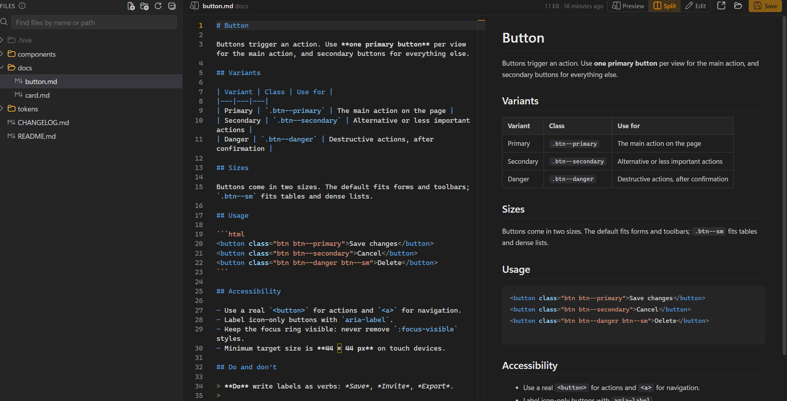

<p align="center"></p>

<h1 align="center">Hive</h1>

<p align="center">An agent-first desktop workspace for AI-assisted coding.<br>Run Claude Code and Codex across your projects, side by side.</p>

<p align="center"><strong><a href="https://surmise.it">Website</a></strong> · <a href="https://surmise.it/docs/user-guide/">User Guide</a> · <a href="https://github.com/Suremise/hive-desktop/releases/latest">Download</a></p>

---

Hive looks and feels like a streamlined VS Code, but it is built around **agent sessions** rather than a text editor. Open a workspace, mark the projects you're working on, and add coding agents to them — **Claude Code** and **Codex**, even side by side in one project. Hive tracks what every agent is doing, how many tokens it uses, and which skills and MCP servers it has, and it tells you when an agent finishes or needs you.

<picture>
  <source media="(prefers-color-scheme: light)" srcset="docs/images/hero-light.png">
  
</picture>

## Features

- **Claude Code and Codex** — each agent chooses its provider, so a project can mix them; each CLI's own terminal is shown. Turn providers on in Settings → Providers; Help → Agent Setup installs and signs them in. **Hand Over to…** passes work from one agent to another, across providers, through a handover.
- **Parallel sessions** — sessions across your projects, as many as your machine can run, with live status (ready / working / needs input / waiting on background tasks / finished), Compact, and screenshots pasted straight into the session.
- **Several agents per project** — up to twelve, all equal, six to a page, side by side in columns or a grid (the layout follows as you add them), each in the project folder (with file locks so they don't edit the same file) or in its own git worktree, then review and merge their work. Each agent shows which conversation it's on; Resume picks from recent sessions, and a conversation is only ever open in one agent.
- **Hive Assistant** — one per workspace, in a side panel: ask it what your agents are doing, or let it add agents, give them tasks, wait for them and hand work between them. Personas set its role; Settings → Assistant sets what it may do.
- **Several windows** — open another workspace in its own window, each with its own projects and agents.
- **Transcript viewer** — read every session in full, including what came before each compaction, search across sessions, export as Markdown and resume.
- **Files** — a file browser with an editor and previews for Markdown, CSV, HTML, SVG, images and PDFs; an Images tab for everything sent to the agents.
- **Review** — git changes with side-by-side diffs; edit `CLAUDE.md`, `AGENTS.md` and Claude Code's auto memory, or share one `AGENTS.md` between providers.

<picture>
  <source media="(prefers-color-scheme: light)" srcset="docs/images/merge-light.png">
  
</picture>
<picture>
  <source media="(prefers-color-scheme: light)" srcset="docs/images/files-light.png">
  
</picture>

- **Token and plan insight** — a project summary across providers, context size, cache state, re-cache estimate, compaction history, API-equivalent cost (estimated from editable price tables where a provider doesn't report it), and each plan's usage limits with warnings.
- **Workspace and project metadata** — a committed `Workspace/.hive` for shared notes, skills and MCP servers; a git-excluded `Project/.hive` for settings, session history, images and transcript backups.
- **Skills and MCP management** — every Hive skill reaches every agent, with six bundled; enable MCP servers for the whole workspace and turn them off per project. Changes apply to new sessions.
- **Session lifecycle** — new, resume (the agent's last session, or pick one), stop, archive, delete (Hive's copies go to the Recycle Bin), adopt sessions started elsewhere.
- **Per-provider and per-project settings** — model, effort, permission mode, extra CLI arguments, globally per provider and overridden per project or agent.
- **Agent API** — a local REST API and a built-in `hive` MCP server so agents can read shared notes, write handovers, check other projects and notify you.
- **Keeps itself up to date** — updates download in the background and install when you quit or restart, never mid-session; or check, download and install manually.
- **Stays out of the way** — system tray, completion chime, Windows notifications, a project list that collapses to status dots, resizable panes, command palette and keyboard shortcuts.

## Requirements

- Windows 10 or 11 (x64)
- At least one coding agent CLI: [Claude Code](https://code.claude.com/docs/en/setup) and/or [Codex](https://developers.openai.com/codex). Hive's Agent Setup offers to install them. Copies built into editor extensions are not used.
- Git (optional, for the Changes tab)

## Install

Download `Hive-Setup-<version>.exe` from the [latest release](https://github.com/Suremise/hive-desktop/releases/latest) and run it. The installer is not code-signed, so Windows SmartScreen may warn you; choose **More info → Run anyway**. After that Hive keeps itself up to date.

To build the installer yourself, run `npm run dist`; it's written to `dist/`.

## Development

```bash
npm install
npm run dev        # run with hot reload
npm run typecheck  # TypeScript checks
npm run lint       # oxlint
npm test           # unit tests (also run by CI on every push)
npm run e2e        # end-to-end suites against a dev build (see tests/e2e/README.md)
npm run icons      # regenerate icons from build/*.svg
npm run licenses   # regenerate THIRD_PARTY_NOTICES.md (also run by build)
npm run dist       # build the Windows installer into dist/
npm run release    # build and upload a draft GitHub release (see RELEASING.md)
```

| Path | Contents |
|---|---|
| `src/main` | Electron main process: workspaces, sessions (node-pty), hooks, Agent API, tray |
| `src/main/providers` | Provider adapters (Claude Code, Codex): launch, hooks, transcripts, usage |
| `src/main/mcp/hive-mcp.ts` | The built-in `hive` MCP server |
| `src/preload` | Typed bridge between the UI and the main process |
| `src/renderer` | React UI |
| `src/shared` | Types, defaults and provider descriptors shared by both sides |
| `tests/` | Unit tests (Vitest) and end-to-end suites (`tests/e2e`, Playwright) |
| `docs/` | Specification, user guide, Agent API reference, architecture |
| `scripts/` | Icon generation, third-party licence notices |

See [docs/ARCHITECTURE.md](docs/ARCHITECTURE.md) for how it fits together and [docs/SPEC.md](docs/SPEC.md) for product decisions.

## Documentation

- [User Guide](docs/USER_GUIDE.md)
- [Agent API](docs/AGENT_API.md)
- [Architecture](docs/ARCHITECTURE.md)
- [Specification](docs/SPEC.md)
- [Release Notes](CHANGELOG.md)
- [Third-Party Notices](THIRD_PARTY_NOTICES.md)
- [Releasing](RELEASING.md)

## License

Hive is released under the [MIT License](LICENSE). It includes open-source libraries under their own licences; see [THIRD_PARTY_NOTICES.md](THIRD_PARTY_NOTICES.md). Electron's and Chromium's licences are installed alongside the app.

Hive is an independent project and is not affiliated with Anthropic or OpenAI. Claude and Claude Code are products of Anthropic, and Codex and ChatGPT products of OpenAI; each CLI is installed separately under its maker's terms. Provider logos are their owners' trademarks, used to identify their products.
